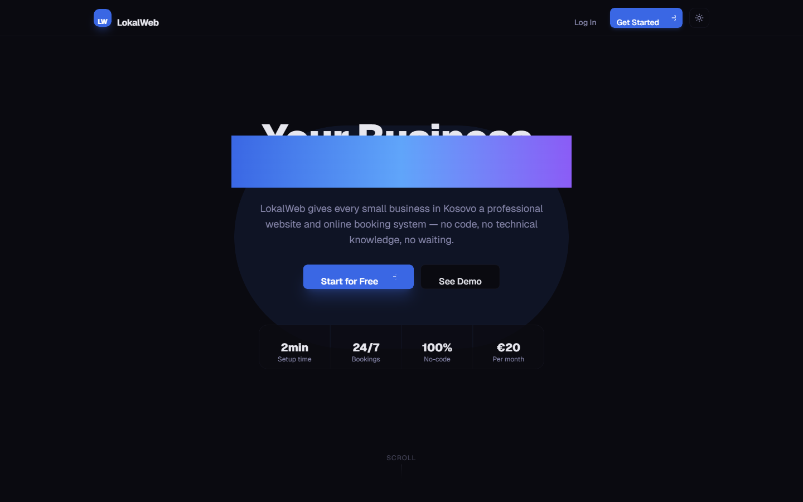
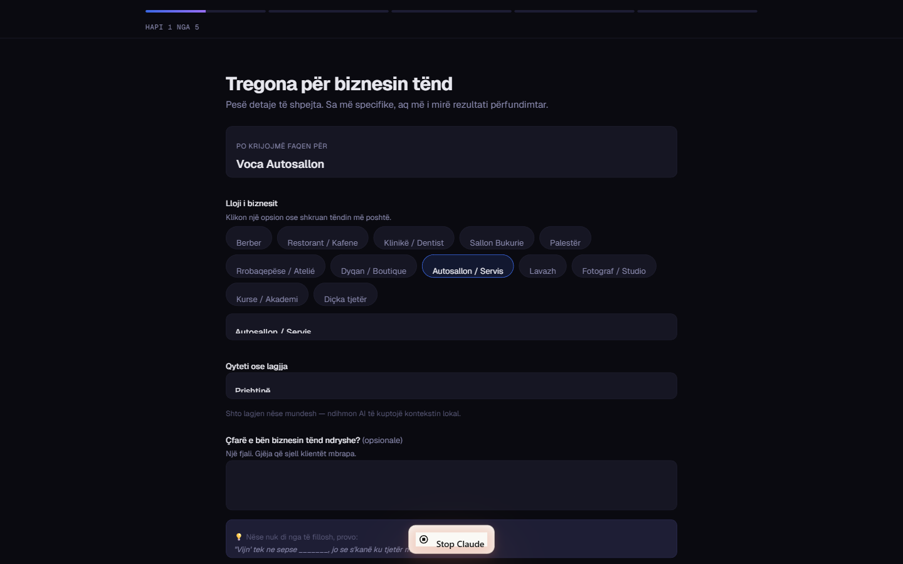
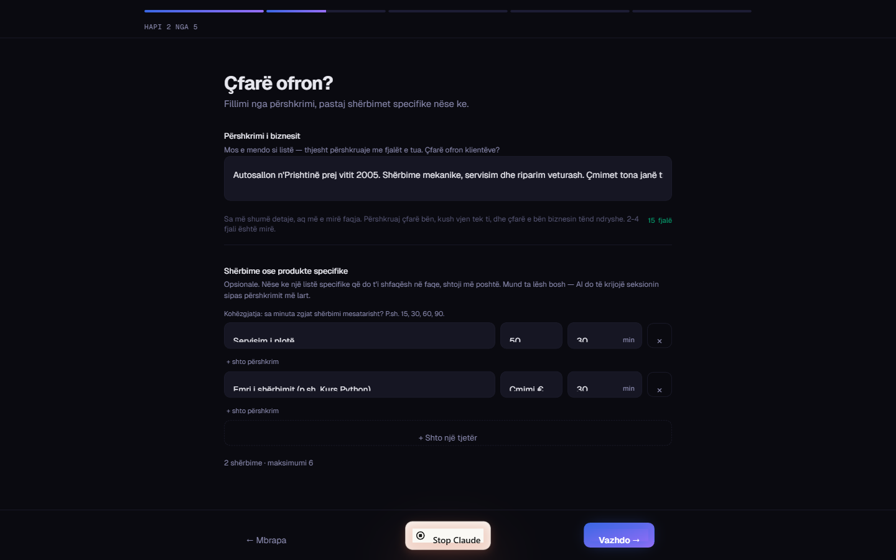
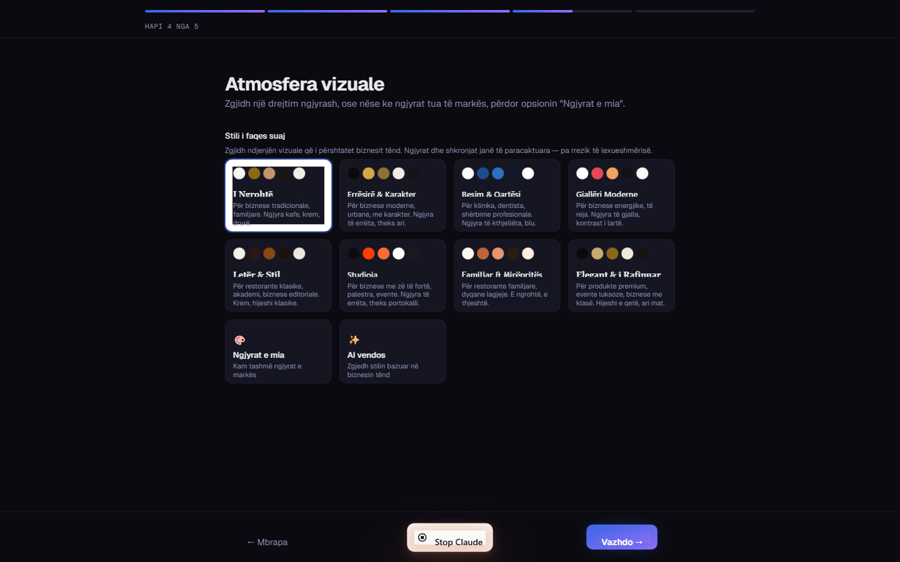
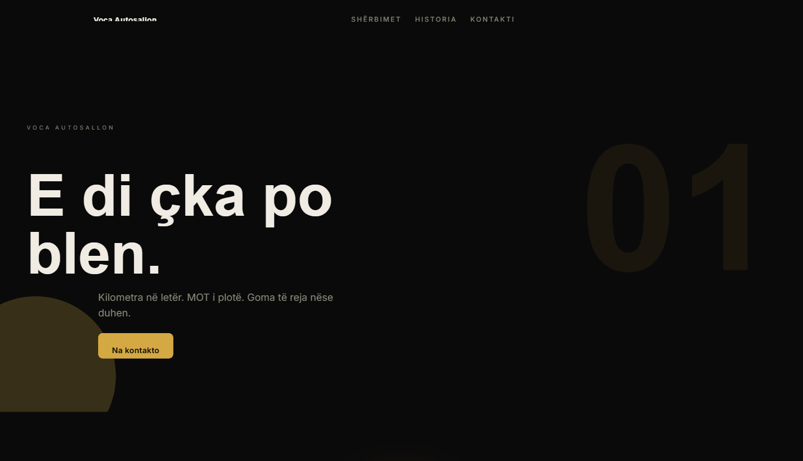
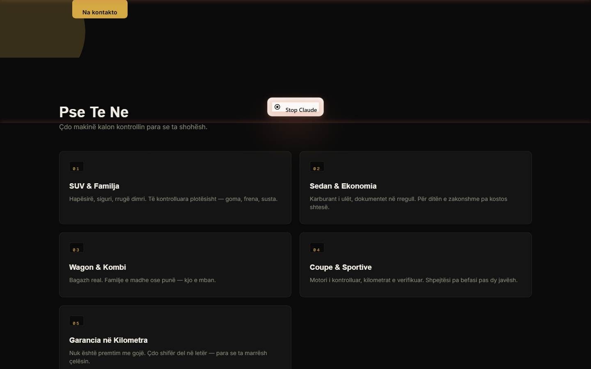
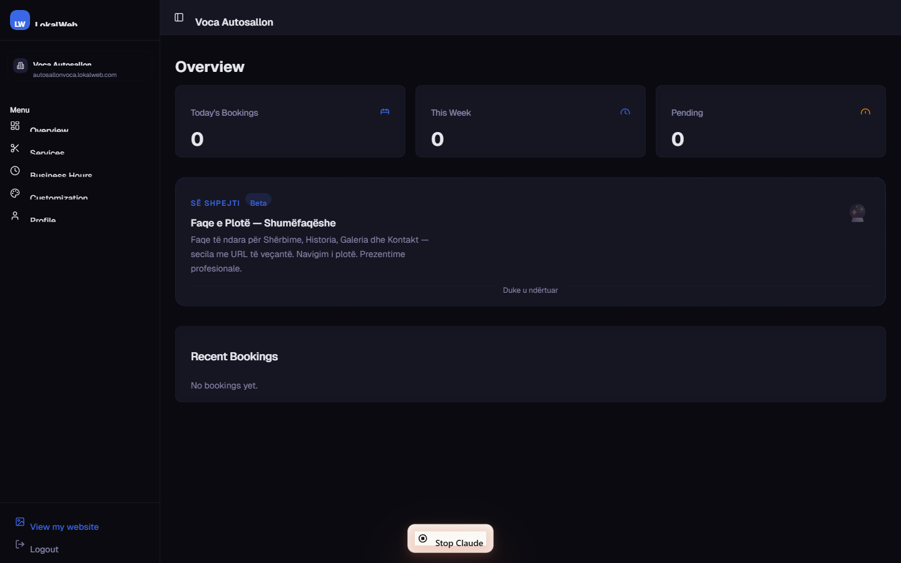
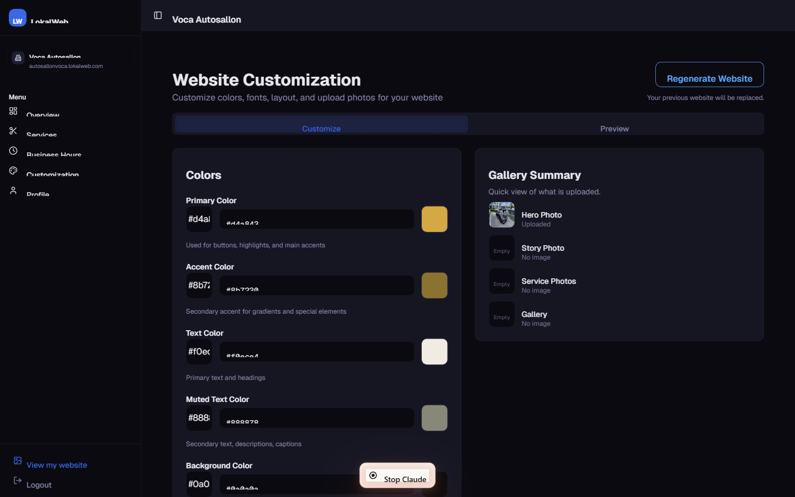

<div align="center">

# 🚀 LokalWeb

**SaaS Platform (Website-as-a-Service) për Bizneset Lokale në Kosovë.**

_Përshkruaje biznesin tënd me fjalë të thjeshta — AI gjeneron faqen e plotë profesionale në më pak se një minutë._

[](https://nextjs.org)
[](https://typescriptlang.org)
[](https://supabase.com)
[](https://anthropic.com)
[](https://tailwindcss.com)
[](https://vercel.com)

**[Live Demo](https://lokal-web-one.vercel.app)** · **[Demo Plan](docs/demo-plan.md)** · **[Architecture](docs/architecture.md)**

</div>

---

## 🌟 Përmbledhja

Shumë biznese lokale në Kosovë — barberë, klinika, restorante, sallone bukurie, dyqane, rrobaqepëse — nuk kanë faqe interneti. Ata ekzistojnë vetëm në Instagram ose TikTok, ku klientët e kanë të vështirë të gjejnë orarin, shërbimet, ose çmimet.

**LokalWeb** e zgjidh këtë duke ofruar:

- **Gjenerim me AI**: Përshkruaje biznesin tënd në pak fjalë, dhe sistemi gjeneron faqen e plotë — tekst, layout, ngjyra, përmbajtje — bazuar në regjistrin autentik të Kosovës.
- **Sistem Rezervimesh**: Klientët rezervojnë termin online, 24/7.
- **Dashboard Menaxhimi**: Pronari mund të editoj tekstet, të ngarkojë foto, dhe të ndryshojë stilin pa kod.



---

## 🎨 Wizard-i — Gjenerimi me AI

Pronari i biznesit kalon nëpër një wizard 5-hapësh ku përshkruan biznesin me fjalët e veta. AI-i ndërton faqen mbi këtë informacion.

|                  **Hapi 1: Të dhënat bazë**                   |              **Hapi 2: Përshkrimi & Shërbimet**              |
| :-----------------------------------------------------------: | :----------------------------------------------------------: |
|   |  |
|                   **Hapi 4: Stili Vizual**                    |                                                              |
|  |                                                              |

> [!NOTE]
> Wizard-i mbledh inputet (industria, qyteti, përshkrimi, shërbimet, toni i komunikimit, gjuha). AI-i përkthen këto inpute në një faqe profesionale me përmbajtje të personalizuar për tregun kosovar.

---

## 🌐 Faqe të Gjeneruara

Çdo biznes që përfundon wizard-in merr një faqe publike unike në subdomain-in e vet:

|                  **Hero — Faqja Publike**                  |                   **Shërbimet — Faqja Publike**                    |
| :--------------------------------------------------------: | :----------------------------------------------------------------: |
|  |  |

Çdo faqe është:

- **Plotësisht responsive** — punon në desktop, tablet, mobile
- **E lokalizuar** — tekst në regjistrin kosovar
- **Faktualisht e saktë** — çmimet dhe shërbimet vijnë drejtpërdrejt nga inputet e përdoruesit, AI nuk shpik
- **E dizajnuar** — paleta, fontet dhe layout-i vijnë nga stile vizuale të para-definuara (WCAG compliant)

---

## 📊 Dashboard — Paneli i Menaxhimit

Pas gjenerimit, pronari menaxhon faqen përmes një dashboard intuitiv:

|                          **Overview**                          |                **Customization (Editim teksti & stili)**                 |
| :------------------------------------------------------------: | :----------------------------------------------------------------------: |
|  |  |

---

## 🛠️ Veçoritë Kryesore

### 💼 Për Pronarët e Biznesit

- **Wizard 5-hapësh** për gjenerim të faqes me AI
- **Editim i drejtpërdrejtë i tekstit** të hero-s dhe historisë pas gjenerimit (pa rigjenerim)
- **Menaxhim i shërbimeve** me çmime dhe kohëzgjatje
- **Konfigurim i orarit** për çdo ditë të javës
- **Galeri fotografike** e ngarkuar në Supabase Storage
- **Personalizim vizual** përmes 8 stileve vizuale të para-validuara

### 👥 Për Klientët

- **Booking Drawer** modern me 3 hapa (Shërbimi → Orari → Konfirmimi)
- **Mobile-first design** — gjithçka punon në celular
- **Kontakt direkt** përmes WhatsApp dhe telefonit

### 🧪 Për Zhvilluesit / Akademinë

- **Multi-tenant arkitekturë** përmes Next.js Middleware (subdomain routing)
- **Row Level Security (RLS)** në Supabase për izolim të dhënash për tenant
- **AI Pipeline 4-fazësh** me validim dhe post-processing
- **Lab-CRUD Module**: Implementim akademik i Layered Architecture (Repository → Service → API → UI) me CSV storage

---

## 🤖 Pipeline-i i AI-it

Pjesa më teknike e projektit. Gjenerimi i një faqeje është një proces me 4 faza, jo një thirrje e vetme në model:

```text
Wizard Inputs
    ↓
[Stage 1] Brand Brief Generator (Claude Haiku)
    → JSON i strukturuar: positioning, voice, target customer, defining traits
    ↓
[Stage 2] Theme Generator (Haiku ose Sonnet sipas tonit)
    → JSON me sections[]: hero, shërbimet, historia, footer
    ↓
[Stage 3] Post-processor (kodi tradicional)
    → Aplikon paleta nga stile vizuale
    → Vendos çmimet/kohëzgjatjet nga inputet e përdoruesit
    → Validon CTA-të kundër veprimeve reale të faqes
    → Aplikon zëvendësime leksikore (tani→tash, çfarë→çka, tek→te)
    ↓
[Stage 4] Validation & Rigjenerim
    → Skanon për fraza të ndaluara
    → Verifikon gjatësinë e teksteve
    → Rigjeneron një herë me feedback nëse dështon
    ↓
Faqja e Gjeneruar
```

**Pse kjo arkitekturë:** Modelet e AI-it janë krijues por jo të besueshëm për saktësi faktike. Pipeline-i ndan përgjegjësitë — krijimi i lihet AI-it, kontrolli i takon kodit. Rezultati është më i besueshëm se çdo prompt-engineering i izoluar.

Më shumë detaje teknike: [docs/architecture.md](docs/architecture.md)

---

## 🏗️ Stack-u Teknik

- **Frontend**: Next.js 14 (App Router), TypeScript, Tailwind CSS, shadcn/ui, Framer Motion
- **Backend**: Supabase (PostgreSQL, Auth, Storage, RLS)
- **AI**: Anthropic Claude (Haiku për brief, Haiku/Sonnet për tema)
- **Deploy**: Vercel
- **State**: TanStack Query (React Query) v5
- **Maps**: OpenStreetMap + Nominatim (gjeokodim)

### Data Flow Pattern

```text
Request (subdomain.lokalweb.com)
    → Next.js Middleware (subdomain detection)
    → Rewrite to /[subdomain] route
    → SSR Page Component
    → Supabase (RLS check)
    → Render
```

---

## 🚀 Quick Start

### 1. Klonimi

```bash
git clone https://github.com/VocaDev/Lokal_Web.git
cd Lokal_Web
```

### 2. Instalimi & Konfigurimi

```bash
npm install
cp .env.example .env.local
```

Vendos variablat në `.env.local`:

```bash
NEXT_PUBLIC_SUPABASE_URL=your_supabase_url
NEXT_PUBLIC_SUPABASE_ANON_KEY=your_anon_key
ANTHROPIC_API_KEY=your_anthropic_key
```

### 3. Serveri i Zhvillimit

```bash
npm run dev
```

Hapet në [http://localhost:3000](http://localhost:3000).

### 4. Testet

```bash
npm test              # Vitest unit tests
npm run test:wizard   # Playwright E2E (kërkon: npx playwright install)
```

---

## 📈 Roadmap

### ✅ E përfunduar

- [x] Migrimi në Next.js 14 App Router
- [x] Sistemi i Autentikimit & RLS
- [x] Multi-tenancy (Subdomains)
- [x] AI Pipeline 4-fazësh me Brand Brief + Theme Generation
- [x] Post-processor me archetype palettes, lexical substitutions, validation
- [x] Wizard 5-hapësh me stile vizuale
- [x] Editim direkt i tekstit (hero/story) nga dashboard
- [x] Menaxhim i shërbimeve, orarit, galerisë
- [x] PWA support përmes next-pwa
- [x] Deploy në Vercel

### 🔄 Në plan

- [ ] Refactor i strukturës së seksioneve për diversitet më të madh në output
- [ ] Integrim me WhatsApp për notifikime
- [ ] Super Admin Panel për menaxhim të platformës
- [ ] Analitika për bizneset
- [ ] Sistem pagesash online për abonime

---

## 📚 Dokumentacioni

- [Demo Plan](docs/demo-plan.md) — plani për prezantimin akademik
- [Architecture](docs/architecture.md) — arkitektura teknike e plotë
- [Project Audit](docs/project-audit.md) — auditi i projektit
- [Improvement Report](docs/improvement-report.md) — raporti i përmirësimeve
- [Testing Strategy](docs/testing-strategy.md) — strategjia e testimit

---

## ✍️ Autori

Ndërtuar nga **Gentian Voca** — Student i vitit të dytë në Software Engineering.

Projekti synon të ofrojë një zgjidhje reale për tregun kosovar dhe njëkohësisht të dëshmojë praktika moderne të zhvillimit të softuerit (multi-tenancy, AI integration, structured generation, validation pipelines, RLS, SSR).

---

## 📜 Licenca

Aktualisht i palicencuar. Të gjitha të drejtat të rezervuara.
