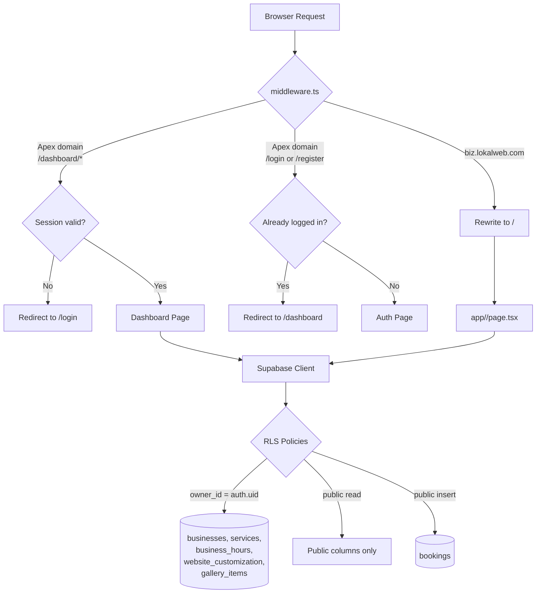

# Architecture — LokalWeb

## Section 1: Overview

LokalWeb is a multi-tenant SaaS platform where each business gets its own subdomain (e.g. `barbershop.lokalweb.com`). A single Next.js 14 App Router codebase serves three surfaces from the same deployment:

1. **Marketing + auth** on the apex domain (`/`, `/login`, `/register`, `/forgot-password`, `/reset-password`)
2. **Dashboard** on the apex domain (`/dashboard/*`) — owners manage their business
3. **Public tenant sites** on subdomains — rewritten internally to `/[subdomain]`

`middleware.ts` intercepts every request before any page renders. If the hostname is the apex it handles auth gating; if it's a subdomain it rewrites the request into the dynamic `/[subdomain]` route. Supabase Row Level Security enforces data isolation at the database level, so one business can never read or modify another's data — no extra backend server required.

The combination of middleware-based routing and RLS-based isolation is what makes true multi-tenancy possible without a separate backend.

## Section 2: Request Lifecycle



The public site page (`app/[subdomain]/page.tsx`) explicitly allow-lists columns when reading the `businesses` row — internal flags, AI setup data, and `owner_id` never reach the public payload. RLS migration 011 is the database-level half of the same defence.

## Section 3: AI Generation Pipeline

The wizard at `/dashboard/website-builder` runs a four-stage pipeline. Stages 1 and 2 are model calls; stages 3 and 4 are deterministic code.

```text
Wizard inputs (industry, city, description, services, tone, language, archetype, layouts)
    ↓
[Stage 1] Brand Brief — Claude Haiku
    runner: src/lib/ai/brand-brief.ts
    route:  app/api/brand-brief/route.ts
    output: { positioning, definingTraits[3], targetCustomer, voice, culturalAnchor }
    ↓
[Stage 2] Theme Generation — Haiku (default) or Sonnet (override)
    runner: src/lib/ai/theme.ts
    route:  app/api/generate-variants/route.ts
    output: { theme tokens (optional), sections[] }
    sections[] is an array of parametric descriptors
    (kind: hero | services | story | gallery | testimonials | faq | footer)
    ↓
[Stage 3] Post-processing — pure code, in the route handler
    - Resolve archetype → 7-token palette + heading/body fonts
      (src/lib/archetypes.ts; AI never invents hex values)
    - Overwrite service prices/durations from user inputs
    - Detect business shape (src/lib/business-shape.ts) and rewrite
      section headers ("Shërbimet" vs "Produktet" vs "Kurset")
    - Apply Kosovar lexical substitutions
      (src/lib/kosovo-substitutions.ts: tani→tash, çfarë→çka)
    - Validate CTAs against real site actions
    ↓
[Stage 4] Validation + retry
    - Scan section copy for banned phrases (src/lib/banned-phrases.ts)
    - Verify text length bounds
    - On fail: regenerate once with structured feedback
    ↓
{ ...themeTokens, sections: AiSection[] } → website_customization.ai_sections
```

Progress is streamed back to the wizard via Supabase Realtime. The route handlers call `emitProgress` (`src/lib/ai-progress.ts`) at each stage transition; the wizard subscribes by `(generationId, businessId)`.

The pure runners (`src/lib/ai/*.ts`) are split out from the route handlers because the Next.js App Router rejects non-handler exports in `route.ts` files. The split also lets the local A/B harness in `scripts/` call the model directly, bypassing auth and rate limiting.

Rate limiting and per-user cost tracking live in `src/lib/api-auth.ts` (`bumpAiUsage`) and table `ai_usage_rate_limit` (migration 010). Every model call is gated.

## Section 4: Rendering — Two Paths

Each subdomain page picks one of two renderers based on whether the wizard has produced an `ai_sections` payload:

| Path | When used | Component | Notes |
|---|---|---|---|
| **Parametric** | Business completed the wizard (`website_customization.ai_sections` is populated) | `src/components/templates/ai/DynamicSiteRenderer.tsx` | Renderer interprets generic `AiSection[]` descriptors into Hero/Services/Story/Gallery/Footer sections with archetype-driven theming |
| **Custom legacy** | Older businesses or hand-picked templates | `src/components/templates/index.tsx` (TemplateRouter) → industry+templateId → custom React component (e.g. `BarbershopMinimal`, `RestaurantElegant`, `ClinicPremium`) | Used for industries/businesses that haven't migrated to the AI flow |

The dynamic renderer is the strategic direction; the custom templates are kept as fallbacks for industries where parametric output isn't yet strong enough (e.g. gyms reuse a barbershop template).

## Section 5: Booking Flow

```text
Public site → BookingDrawer (3 steps: service → time → confirm)
            → POST /api/... → bookings table (public INSERT via RLS)

Owner dashboard → /dashboard/bookings
            → bookingService.confirm/cancel/complete
            → store.updateBookingStatus
            → Supabase
```

`src/lib/services/bookingService.ts` enforces the status state machine:

```text
pending   → confirmed | cancelled
confirmed → completed | cancelled
completed → (terminal)
cancelled → (terminal)
```

The page component (`app/dashboard/bookings/page.tsx`) calls named functions (`confirmBooking`, `cancelBooking`, `completeBooking`) and reacts to a typed `BookingActionResult` object. The component holds zero knowledge of which transitions are legal — that's owned by the service. The contract is non-throwing: errors are returned in the result, never thrown, so the UI can render them deterministically.

## Section 6: Academic CRUD Module

`src/lib/academic-module/` is a self-contained Repository → Service → Route demonstration of layered architecture, exposed through `POST /api/export-report`:

| File | Layer | Responsibility |
|---|---|---|
| `repositories/BookingRepository.ts` | Data | Fetches bookings for a business; validates UUID at the boundary |
| `repositories/FileRepository.ts` | Data | Reads/writes plain-text reports under `reports/` |
| `services/ExportService.ts` | Service | Aggregates booking stats and writes the report file via the two repositories |
| `app/api/export-report/route.ts` | API | Resolves session + business, instantiates the service, returns the report |

The module is intentionally separate from the production Supabase data layer in `src/lib/store.ts`. It exists to demonstrate the textbook layered pattern (Repository → Service → API → UI) with file-based output, while the rest of the app uses a flatter direct-to-Supabase pattern.

## Section 7: Database Schema

Migrations live under `supabase/migrations/` (004 through 019). Highlights:

| Table | Purpose | Key RLS rule |
|---|---|---|
| `businesses` | One row per tenant. Stores subdomain, owner_id, profile data, AI setup snapshot, `booking_enabled` toggle | Owner-only INSERT/UPDATE/DELETE on own row (`owner_id = auth.uid()`) |
| `services` | Services / products / courses offered by a business (name, price, duration) | Owner-scoped via subquery on parent business; public SELECT |
| `business_hours` | Opening hours per day-of-week | Owner-scoped; public SELECT |
| `website_customization` | Theme tokens, fonts, layout choices, and the `ai_sections` payload from the AI pipeline | Owner-scoped; public SELECT |
| `gallery_items` | Photos per section (hero / story / services / gallery) — consolidated in migration 016 | Owner-scoped writes; public SELECT |
| `bookings` | Customer appointments with status lifecycle and `party_size` | Public INSERT (customers book without login); owner SELECT/UPDATE/DELETE |
| `ai_usage_rate_limit` | Per-user model-call counters (migration 010) | Server-side only |
| `ai_generation_events` | Progress events streamed to the wizard via Supabase Realtime (migration 017) | Owner SELECT on own business |

Migration 011 hardened RLS across the public tables; migration 014 added the wizard v2 input columns; migration 015 added the AI sections payload; migration 019 added the booking-enabled toggle.

## Section 8: Key Files

### Routing & auth
| File | Responsibility |
|---|---|
| `middleware.ts` | Resolves subdomain tenants OR enforces auth on `/dashboard/*` |
| `src/lib/supabase/{client,server,middleware}.ts` | SSR-safe Supabase clients (browser, server components/routes, middleware) |
| `src/lib/api-auth.ts` | `requireUser`, `requireBusinessOwner`, `bumpAiUsage` — used by all API routes |

### AI pipeline
| File | Responsibility |
|---|---|
| `src/lib/ai/brand-brief.ts` | Stage 1 model call (pure runner) |
| `src/lib/ai/theme.ts` | Stage 2 model call (pure runner) |
| `app/api/brand-brief/route.ts` | Stage 1 production wrapper (auth + rate limit + progress) |
| `app/api/generate-variants/route.ts` | Stage 2 production wrapper (also runs post-processing + validation + retry) |
| `app/api/apply-theme/route.ts` | Persists the chosen theme to `website_customization` |
| `src/lib/anthropic.ts` | Anthropic SDK client |
| `src/lib/ai-progress.ts` | `emitProgress` — writes to `ai_generation_events` for Realtime streaming |
| `src/lib/archetypes.ts` | 8 pre-validated visual systems (palette + fonts + layout hints) |
| `src/lib/banned-phrases.ts` | Forbidden marketing-speak the validator scans for |
| `src/lib/business-shape.ts` | Industry-aware section labelling (services vs products vs courses) |
| `src/lib/kosovo-substitutions.ts` | Lexical pass for Kosovar Albanian register |
| `src/lib/json-extract.ts` | Resilient JSON parser for model output |

### Rendering
| File | Responsibility |
|---|---|
| `app/[subdomain]/page.tsx` | Public business website — resolves tenant, decides parametric vs custom path |
| `src/components/templates/ai/DynamicSiteRenderer.tsx` | Parametric renderer for AI-generated sites |
| `src/components/templates/ai/sections/*` | `HeroSection`, `ServicesSection`, `StorySection`, `GallerySection`, `FooterSection` |
| `src/components/templates/index.tsx` | Legacy TemplateRouter (industry × templateId → custom component) |
| `src/components/templates/custom/*` | Hand-built per-industry templates (BarbershopMinimal, RestaurantElegant, ClinicPremium, …) |
| `src/components/templates/shared/BookingDrawer.tsx` | Customer booking UI used by both render paths |

### Wizard & dashboard
| File | Responsibility |
|---|---|
| `src/components/website-builder/WizardV2.tsx` | 5-step wizard UI (industry → description/services → layouts → archetype → tone/language) |
| `app/dashboard/website-builder/page.tsx` | Wizard host page |
| `app/dashboard/customization/page.tsx` | Customization Hub — direct text editing, colors, typography, gallery |
| `src/components/dashboard/CustomizationHub/*` | Color, typography, content, gallery sections + live preview |
| `app/dashboard/bookings/page.tsx` | Bookings list — delegates state changes to `bookingService` |
| `app/dashboard/{services,hours,profile,new-business}/page.tsx` | CRUD UIs for the rest of the tenant data |

### Data layer & domain logic
| File | Responsibility |
|---|---|
| `src/lib/store.ts` | Direct Supabase queries; converts `camelCase` ↔ `snake_case` |
| `src/lib/services/bookingService.ts` | Booking status state machine; non-throwing contract |
| `src/lib/academic-module/*` | Repository → Service demonstration powering `POST /api/export-report` |
| `src/lib/validators.ts` | Kosovo phone, email, password, subdomain validation |
| `src/lib/types/customization.ts` | Authoritative TypeScript shape for `AiSection[]` and `WebsiteCustomization` |
