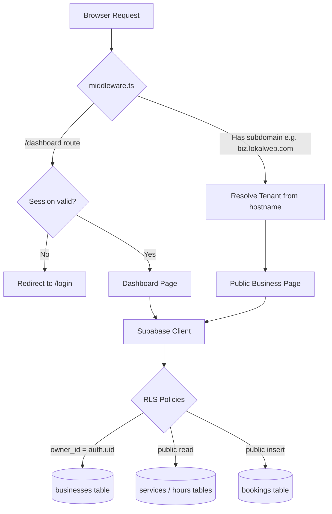

# Architecture — LokalWeb

## Section 1: Overview

LokalWeb is a multi-tenant SaaS platform where each business gets its own subdomain (e.g. `barbershop.lokalweb.com`). Next.js middleware intercepts every request before any page renders and resolves which tenant is active from the hostname. Supabase Row Level Security enforces data isolation at the database level, so one business can never read or modify another's data — no extra backend logic required. The combination of middleware-based routing and RLS-based isolation is what makes true multi-tenancy possible without a separate backend server.

## Section 2: Request Lifecycle



## Section 3: Service Layer (New in Week 6)

```text
BEFORE:
Page Component → store.ts → Supabase

AFTER:
Page Component → bookingService.ts → store.ts → Supabase
                       ↑
               Validates transitions
               Handles all errors
               Returns typed results
               Never throws
```

The component no longer contains any knowledge of what a valid status transition is. It calls a named function (`confirmBooking`, `cancelBooking`) and reacts to a typed result object. This makes the component easier to read, and makes the business rules easier to test in isolation.

## Section 4: Database Schema

| Table | Purpose | Key RLS Rule |
|---|---|---|
| `businesses` | One row per tenant. Stores subdomain, owner_id, profile data | Owner can INSERT/UPDATE/DELETE their own row only (`owner_id = auth.uid()`) |
| `services` | Services offered by a business (name, price, duration) | Owner-scoped via subquery on parent business |
| `business_hours` | Opening hours per day of week | Owner-scoped via subquery on parent business |
| `bookings` | Customer appointments with status lifecycle | Public INSERT (customers book without login), owner UPDATE/DELETE |

## Section 5: Key Files

| File | Responsibility |
|---|---|
| `middleware.ts` | Intercepts all requests — resolves subdomain tenant OR checks auth session |
| `src/lib/supabase/client.ts` | Supabase browser client for `'use client'` components |
| `src/lib/supabase/server.ts` | Supabase server client for Server Components and Route Handlers |
| `src/lib/store.ts` | Data access layer — all direct Supabase queries live here |
| `src/lib/services/bookingService.ts` | Business logic for booking status transitions — validates rules, handles errors |
| `app/dashboard/bookings/page.tsx` | UI component — displays bookings, delegates all logic to bookingService |
| `app/[subdomain]/page.tsx` | Public business website — resolves tenant from URL and renders their data |
